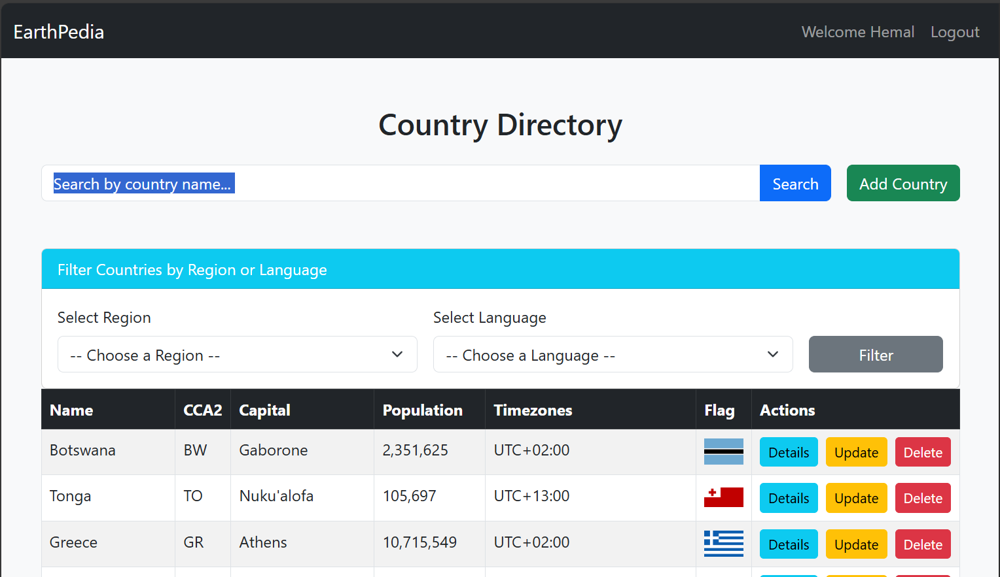
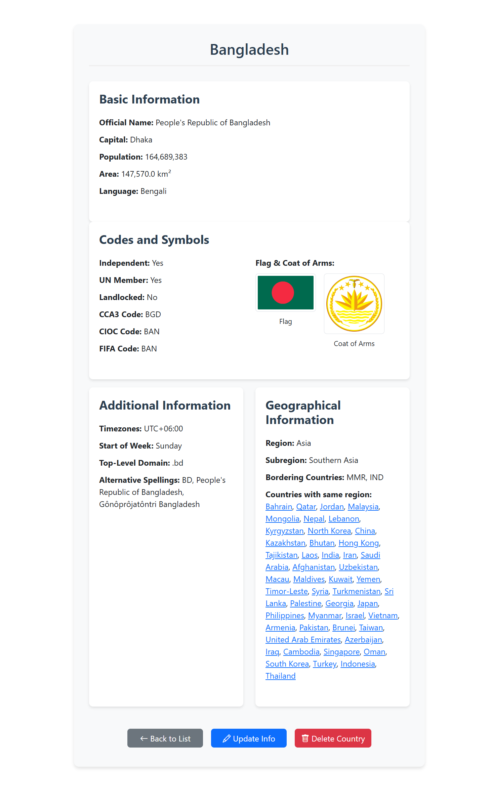
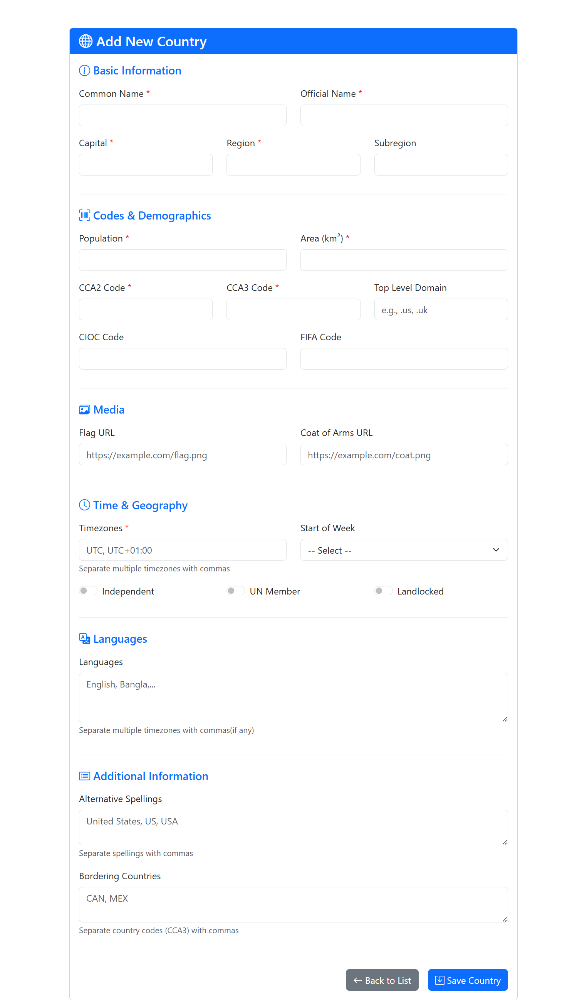
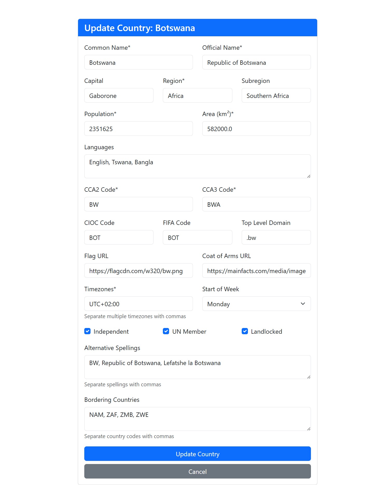
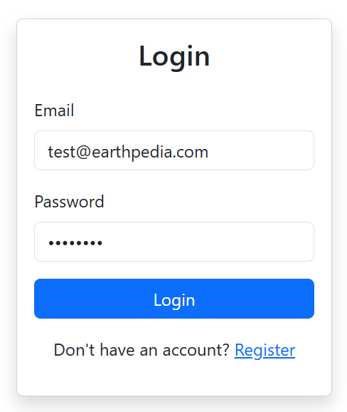
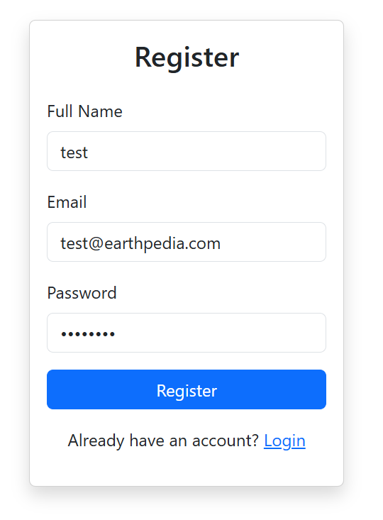

# EarthPedia
# 🌍 Countries Explorer - Django Web Application

A feature-rich web application for exploring, managing, and learning about countries worldwide with user authentication and CRUD functionality.

## 📋 Table of Contents
- [Features](#-features)
- [Installation](#-installation)
- [Usage](#-usage)
- [Project Structure](#-project-structure)
- [API Reference](#-api-reference)
- [Screenshots](#-screenshots)

## ✨ Features
- **User Authentication**: Login, registration, and logout
- **Country Management**: Add, edit, view, and delete countries
- **Advanced Filtering**: Search by name, region, or language
- **Responsive Design**: Works on desktop and mobile devices

## 🛠 Installation

### Prerequisites
- Python 3.9+
- Django 5.1.6
- SQLite (included with Python)

### Setup Steps
1. **Clone the repository**:
   ```bash
   git clone https://github.com/yourusername/countries-explorer.git
   cd countries-explorer
2. **Create and activate virtual environment(recomended)**:
    ```bash
   python -m venv venv
   # Linux/MacOS
   source venv/bin/activate
   # Windows
   venv\Scripts\activate
3. **Install dependencies**:
   ```bash
   pip install django==5.1.6
4. **Set up database**:
   ```bash
   python manage.py makemigrations
   python manage.py migrate
5. **Run the development server**:
   ```bash
   python manage.py runserver

## 🚀 Usage

Access the application at: [http://localhost:8000](http://localhost:8000)

### 🔐 Default Test Accounts
  - Email: `test@earthpedia.com`
  - Password: `test1234`

## 📂 Project Structure
     ```
     EarthPedia/
        ├── config/                  # Project configuration
        │ ├── settings.py            # Django settings
        │ └── urls.py                # Main URLs
        ├── countries/               # Main app
        │ ├── models.py              # Country data model
        │ ├── views.py               # Application logic
        │ ├── admin.py               # Admin configuration
        | ├── management/commands
        | | ├── fetch_countries.py   # fetch data from the API
        │ └── urls.py                # App URLs
        ├── templates/               # HTML templates
        │ ├── index.html             # Main listing page
        │ ├── country_details.html   # Detail view
        | ├── Add_country.html       # Adding new country
        | ├── Udpate_country.html    # Update the info of a country
        | ├── login.html             # Authenticate user
        │ └── register.html/         # Authorize new user
        ├── db.sqlite3               # Development database
        └── manage.py                # Django CLI


## 🌐 API References

| Endpoint                              | Method     | Description               |
|---------------------------------------|------------|---------------------------|
| `/`                                   | GET        | Homepage with country list |
| `/login`                              | GET/POST   | User login                |
| `/register`                           | GET/POST   | User registration         |
| `/logout`                             | GET        | User logout               |
| `/country_details/<str:name>`        | GET        | Country details including the countries with same region |
| `/Add_country`                        | GET/POST   | Add new country           |
| `/Update_country/<str:name>`         | GET/POST   | Update country            |
| `/Delete_country/<str:name>`         | POST       | Delete country            |

## 📸 Screenshots

### 🏠 Homepage (index.html)


### 🌍 Country Details Page (country_details.html)


### ➕ Add Country Page (Add_country.html)


### ✏️ Update Country Page (Udpate_country.html)


### 🔐 Login Page (login.html)


### 📝 Register Page (register.html)



